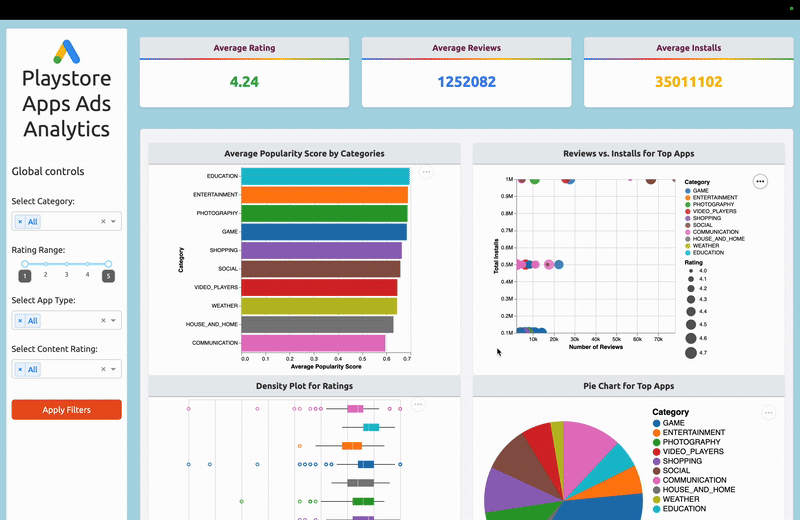

# The Googleplay Apps - Ads Analytics Dashboard

## Authors

- Quanhua Huang
- Yeji Sohn  
- Lukman Lateef
- Ismail (Husain) Bhinderwala

## Motivation and Purpose of the Project

### For Users:

In the world of app advertising, companies face the overwhelming task of analyzing vast amounts of data to pinpoint which apps offer the best potential for advertising placements. With a wide array of app data available, it can be difficult to discern which factors contribute to higher sales, ratings, and user engagement. Our project is designed to address this issue by offering an intuitive platform for advertisers to easily visualize and assess app performance.

**Why is this important?**  
By identifying apps with high engagement and solid user ratings, advertisers can make data-driven decisions to improve their ad targeting strategies. This can dramatically enhance the effectiveness of their advertising campaigns, leading to higher returns on investment (ROI) and more impactful marketing decisions.

### What can users do with the dashboard?  
This dashboard provides an interactive interface where users can explore a variety of app metrics. Features include:
- Filtering apps based on various performance indicators such as ratings, installs, and categories.
- Visualizing key metrics using charts and graphs to compare app performance.
- Identifying high-potential apps to target for advertising campaigns.

**Deployed Link:**  
You can access the deployed dashboard at [this link](https://dsci-532-2025-25-ads-analytics.onrender.com/) to explore the interactive features.

### Demo  
To give you a quick idea of what the dashboard looks like in action, check out our demo GIF below:  



### Getting Support  
If you encounter any issues or need assistance, feel free to [open an issue](https://github.com/UBC-MDS/DSCI-532_2025_25_Ads-Analytics/issues) in the repository.

---

## Description of the data
We are using the [Google Play Store Apps](https://www.kaggle.com/datasets/lava18/google-play-store-apps) dataset, which includes features related to apps on the Google Play Store, such as app names, categories, ratings, and more. Our dataset consists of information on 9,660 apps, each with 9 different features. We aim to leverage these features to analyze how different factors impact ratings and installs, ultimately helping to make more informed advertising decisions.

---

## For Contributors:

If you want to help improve or extend the functionality of this Dashboard, follow the steps below to get started.

### Installing Dependencies & Running Locally:

1. **Clone the repository:**
   ```bash
   git clone https://github.com/your-username/google-play-apps-ads-analytics-dashboard.git
   cd google-play-apps-ads-analytics-dashboard
   ```

2. **Install dependencies:**
   Make sure you have Python installed, then run:
   ```bash
   pip install -r requirements.txt
   ```

3. **Run the app locally:**
   ```bash
   python app.py
   ```

   The app will be accessible at `http://127.0.0.1` in your web browser.

### Contributing Guidelines  
For more detailed information on how to contribute, please refer to our [Contributing Guide](CONTRIBUTING.md).

