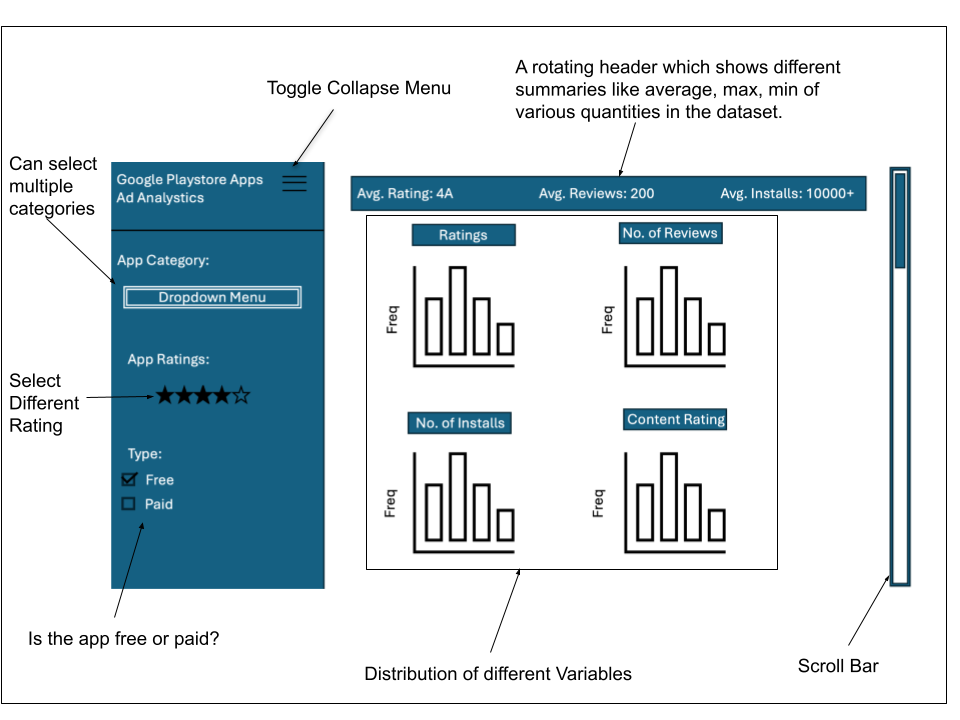

## Section 1: Motivation and Purpose

Our role: Data scientist consultancy firm

Target audience: Advertisement companies

Advertisement companies face the challenge of sifting through large amounts of app data to determine which apps offer the best potential for advertising based on user engagement, ratings, and other metrics. If we could understand the factors that lead to higher sales and ratings, it may be possible to focus development resources to improve sales outcomes. To address this challenge, we propose building a data visualization app that allows the advertisement company to identify the most promising apps to target for ad placements. Solving this problem is crucial because effective ad targeting can significantly boost campaign performance and ROI. This dashboard will simplify decision-making by offering a clear, interactive interface to visualize key app metrics, helping the team identify high-potential apps quickly and make data-driven advertising decisions.

## Section 2: Description of the data
We are using the [Google Play Store Apps](https://www.kaggle.com/datasets/lava18/google-play-store-apps) dataset, which includes features related to apps on the Google Play Store, such as app names, categories, ratings, and more. Our dataset consists of information on 9,660 apps, each with 9 different features. We aim to leverage these features to analyze how different factors impact ratings and installs, ultimately helping to make more informed advertising decisions.

We selected this dataset because it provides a comprehensive view of each app on the Google Play Store, offering valuable insights from various dimensions, including ratings, reviews, and categories. By visualizing the data, we hope to identify key factors that influence decision-making and determine which apps are more likely to benefit from improved ad placements.
We will focus on these nine features:

| **Features** | **Description** |
|-------------|----------------|
| `Category` | Category of the app belongs to |
| `Rating` | Overall user rating of the app |
| `Reviews` | Number of user reviews for the app |
| `Size` | Size of the app |
| `Installs` | Number of user downloads |
| `Type` | Paid or free |
| `Price` | Price for the app |
| `Content Rating` | Targeted age groups |
| `Genres` | Genre of the app |
| `Last Updated ` | Date when app was last updated |
| `Current Ver` | Current version of the app |
| `Android Ver` | Minimum Android version of the app |

In addition to the existing features, we will introduce new variables such as average_reviews (representing the average number of reviews for an app) and average_rating (indicating the app's average rating). These derived variables will provide deeper insights into the patterns, enabling us to draw more reliable conclusions about decision-making in advertising.

Before conducting any analysis, we will perform data wrangling and cleaning to handle missing values and ensure the dataset is ready for further exploration.

## Section 3: Research questions and usage scenarios

**Research Question:**
1. How do app rankings and download counts vary based on user reviews across different categories?
2. What is the relationship between the number of downloads and user ratings for apps?
3. How do specific app features correlate with the number of downloads?
4. How do app categories differ in terms of user engagement and popularity among teens versus the general audience?

Cameron is a marketing manager at a digital marketing agency, and she needs to optimize ad campaigns for her clients. She wants to explore app performance data in order to identify correlations between app features (like price, size, and genre) and downloads/ratings and compare performance across different app categories.

When Cameron logs on to our app analytics dashboard, she will see an overview of apps categorized by genre, size, price, and user ratings. She can filter the apps based on categories like "Games" or "Lifestyle" and sort them by download count and reviews. By comparing apps with different features, Cameron identifies that teen-focused apps tend to perform better when they are lightweight and free. Based on this information, Cameron adjusts her ad targeting strategy to focus on lightweight, free apps in the gaming and lifestyle categories.

Based on her findings from using our dashboard, Cameron hypothesizes that teens prefer apps that are both free and lightweight. She decides to refine her future campaigns by prioritizing these types of apps to improve the effectiveness of her ads.

## Section 4: App sketch & brief description
<figure>
  
  <figcaption>Figure 1: Dashboard showing Google Playstore App Analytics.</figcaption>
</figure>

The app's landing page offers an intuitive and interactive way for users to explore app performance metrics across different categories, helping businesses and advertisers uncover trends in the Google Play Store. Through dynamic visualizations such as bar charts and density plots, users can analyze key insights, including downloads, ratings, and reviews. These distributions are color-coded based on app type or category, making it easier to interpret the data at a glance.

To refine their analysis, users can apply various filters using a dropdown menu. They can narrow down results by specific categories, number of reviews, install counts, app size, or pricing model (Free vs. Paid). A rotating header at the top of the visualization dynamically updates to display key summary statistics based on the selected filters, giving users a quick snapshot of important metrics.

For deeper insights, users can compare two different app categories side by side to observe differences in performance. Additionally, a ranking table highlights the top apps based on ratings, downloads, and number of reviews, adjusting in real-time according to the user's selected filters.

With its interactive design and data-driven insights, this app empowers businesses and advertisers to make informed decisions, identify trends, and optimize their strategies based on real-world app performance. 🚀
